A few examples of dot language to render fancy graphs.

* [Dot language reference][0]
* [viz.js fiddle][1]

## Layout

### Choosing layout engine

{:.my-split-h}
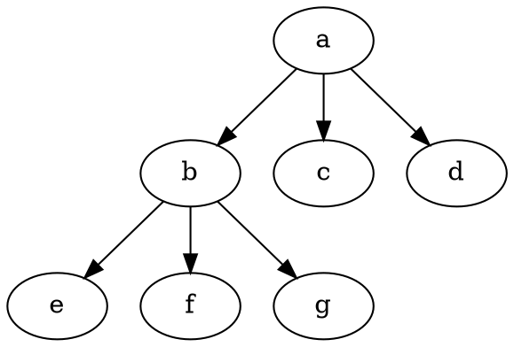

{:.my-split-h}
```myviz
digraph {
  a -> {b c d}
  b -> {e f g}
}
```


{:.my-split-h}
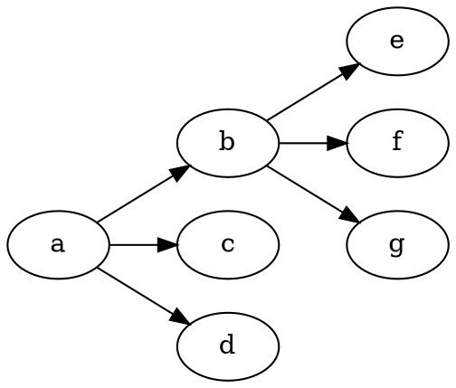

{:.my-split-h}
```myviz
digraph {
  rankdir=LR
  a -> {b c d}
  b -> {e f g}
}
```


{:.my-split-h}
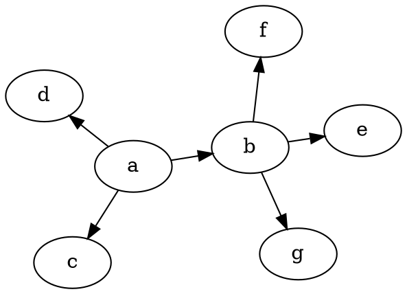

{:.my-split-h}
```myviz
digraph {
  layout=neato
  a -> {b c d}
  b -> {e f g}
}
```


{:.my-split-h}
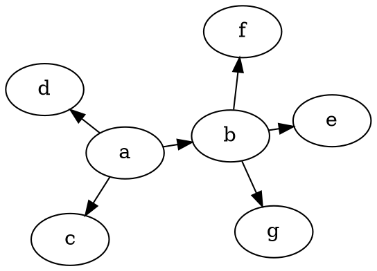

{:.my-split-h}
```myviz
digraph {
  layout=neato
  edge [len=0.8]
  overlap=false
  a -> {b c d}
  b -> {e f g}
}
```


{:.my-split-h}
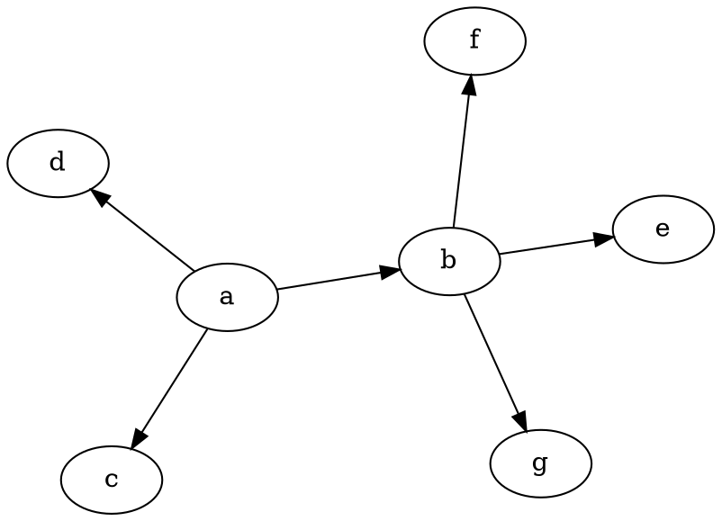

{:.my-split-h}
```myviz
digraph {
  layout=neato
  overlap=false
  sep="+30,-5"
  a -> {b c d}
  b -> {e f g}
}
```

Attributes `overlap`, `sep`, `len` only work for neato engine.

### Playing with rank

{:.my-split-h}
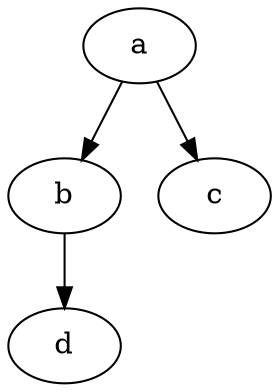

{:.my-split-h}
```myviz
digraph {
  a -> {b c}
  b -> d
}
```

{:.my-split-h}
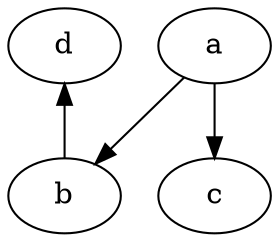

{:.my-split-h}
```myviz
digraph {
  a -> {b c}
  b -> d
  {rank=min d}
}
```

{:.my-split-h}
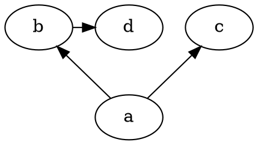

{:.my-split-h}
```myviz
digraph {
  a -> {b c}
  b -> d
  {rank=same b d}
  {rank=max a}
}
```

{:.my-split-h}
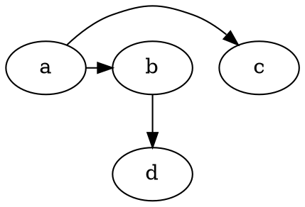

{:.my-split-h}
```myviz
digraph {
  a -> {b c} [constraint=false]
  b -> d
}
```

### Playing with subclusters

{:.my-split-h}
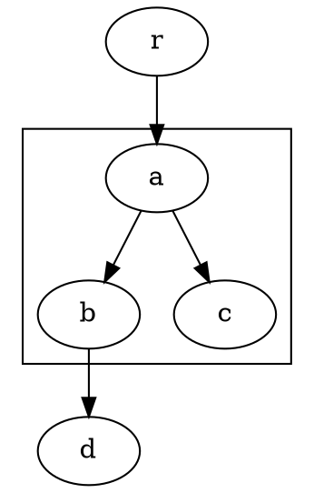

{:.my-split-h}
```myviz
digraph {
  subgraph cluster_cl {
    a -> {b c}
    {rank=min a}
  }
  r -> a
  b -> d
}
```

{:.my-split-h}
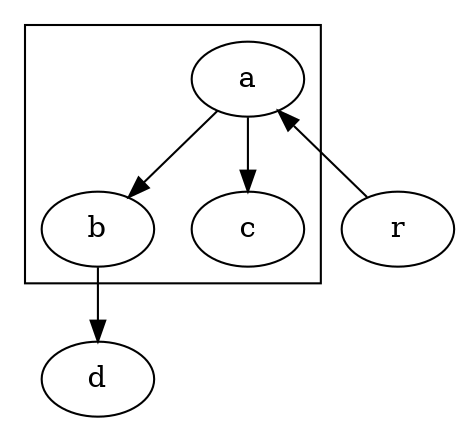

{:.my-split-h}
```myviz
digraph {
  newrank=true
  subgraph cluster_cl {
    a -> {b c}
    {rank=min a}
  }
  r -> a
  b -> d
}
```

{:.my-split-h}
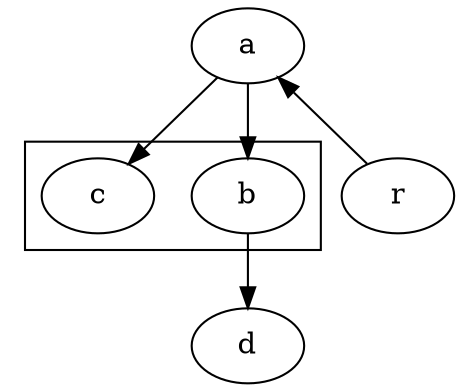

{:.my-split-h}
```myviz
digraph {
  subgraph cluster_cl {
    a -> {b c}
  }
  r -> a
  b -> d
  {rank=min a}
}
```

{:.my-split-h}
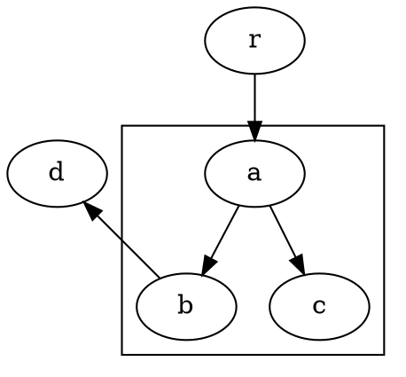

{:.my-split-h}
```myviz
digraph {
  newrank=true
  subgraph cluster_cl {
    a -> {b c}
  }
  r -> a
  b -> d
  {rank=min d}
}
```

### Other neat tricks

{:.my-split-h}
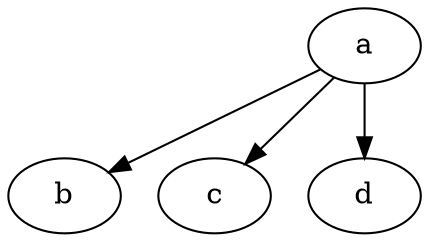

{:.my-split-h}
```myviz
digraph {
  a -> {b c}
  a -> d [weight=3]
}
```


[0]:https://www.graphviz.org/doc/info/
[1]:http://viz-js.com/


